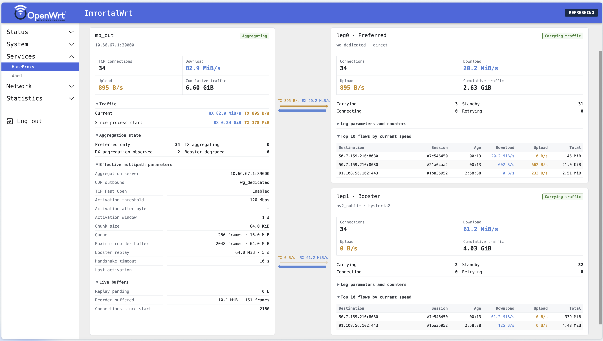

# HomeProxy Multipath

An OpenWrt LuCI frontend based on HomeProxy, updated for sing-box 1.14 and extended with multipath node configuration, connection latency checks, and a live multipath status dashboard.

It is designed to work with [singbox-multipath](https://github.com/WuSiYu/singbox-multipath).

The multipath node form accepts `activation_after_bytes` and `memory_limit` as
either bare byte counts or memory strings such as `2MB`; the latter uses
sing-box's binary memory units. Other byte limits use integer byte counts. The
`activation_after_bytes_min_mbps` field adds a recent-rate gate to
`activation_after_bytes` without changing the existing throughput or leg 0 queue
triggers.

The **Enable local TX aggregation (upload)** switch maps to
`aggregation_enabled`. Turning it off keeps client upload data on the preferred
leg while server downlink aggregation and UDP remain available. The queue, rate,
and byte-count conditions are independent **OR** triggers; any enabled condition
can activate local aggregation. `activation_on_queue` toggles the sustained queue
trigger. A rate or byte threshold of `0` disables that trigger. The minimum rate
after bytes applies only to the byte-count trigger, and `0` removes that extra
gate. With all three triggers disabled, upload stays on the preferred leg.

An empty rate field uses sing-box's default: 150 Mbps when the byte trigger is
disabled, otherwise zero. Explicit zero and disabled switches are preserved in
the generated configuration. These options require a singbox-multipath build
with the corresponding activation controls.

This beta6 branch requires multipath protocol v10 and status schema 3 on the
matching sing-box build. Both multipath endpoints must be upgraded together.
Manual bandwidth weights have been removed; the scheduler observes delivery
through each complete child path. Old bandwidth UCI fields are no longer emitted.
They can remain in saved configurations without influencing scheduling. The
matching sing-box build also accepts legacy JSON `bandwidth_mbps`, ignores it,
and logs a warning when initializing the node.

Receive-window settings apply to local RX. `max_reorder_bytes` bounds receive
storage, including contiguous bytes awaiting application reads;
`max_reorder_frames` is an optional additional ceiling in negotiated chunk-size
units, not a wire-frame count. Empty or zero adds no chunk ceiling. The pending
send capacity (`queue_frames`) applies to local unsent TX data; the connection
send buffer (`leg1_replay_bytes`, retained as a configuration name) holds data for
both paths until the peer's cumulative Data ACK. An empty or zero
`leg1_replay_timeout` uses adaptive delivery timing.

## Multipath Status

The optional **Enable TCP and UDP failover** switch is off by default. It adds
shared path health checks only when enabled. The server must also enable
`failover_enabled`, and both children must reach its TCP and UDP listening port.
The failure timeout defaults to 5 seconds; the preferred-path stability period
defaults to 30 seconds. Both are editable in LuCI and hidden, with values retained,
when recovery is off. Recovery is independent of the aggregation switches.

TCP can retain its target connection on leg1 during a leg0 outage. UDP uses the
common server relay from the beginning, retaining its source socket across switches.
The UDP selector remains an independent preference: selecting leg1 keeps UDP there
when TCP returns to leg0. UDP is not aggregated or carried inside TCP.
With recovery disabled, UDP keeps its existing direct child forwarding behavior.

The top-level status page refreshes every second. A topology diagram links the
aggregate node to leg0 and leg1, with separate upload and download arrows. Each
leg includes directional cumulative traffic, peak speeds, and the ten currently
fastest TCP flows. UDP has separate per-leg counters, including earlier traffic on
a path that is no longer selected. Recovery details show the selected TCP/UDP paths,
the two timers, shared path health, reply ages and continuous healthy time.

Collapsible details distinguish whole-path in-flight data, connection send
history, reinjected bytes/mappings, writer blocking, receive reordering and the
shared memory budget. Download sender counters and delivery estimates come from
server telemetry. Unavailable and stale samples are explicitly marked; delivery
RTT and probe timeout ratios are not physical ping latency or raw IP loss rates.
Hover over a row label for definitions and units. Non-harmless leg events can be
dismissed until a new event arrives. Confirmed local or remote application-endpoint
closures are filtered using sing-box's `last_error_source`, not error-message
matching. Unattributed EOF, reset and cancellation events remain visible. The
destination identifies the affected flow, not a proven fault location. The updated
sing-box excludes confirmed endpoint closures from event/failure counts; other
hidden harmless events may still be counted. Error provenance requires
the updated beta5 on both endpoints; protocol v8 is not compatible.

Reorder counts are 16 KiB storage pages, not wire frames. Their peaks are the
largest per-connection peaks among currently active connections, and can drop
when a connection closes. Send-history and path in-flight peaks persist since
process start and take the maximum of sampled node totals and observed
per-connection peaks; they are not exact continuous aggregate high-water marks.
An older status schema is rejected with an upgrade notice rather than displayed
with beta5 labels.

Leg joins count locally attached transports independently of upload activation.
Joins, attempts and reported remote failure counts include closed connections.
Probe RTT and probe-health values, in contrast, summarize currently active
connections only. Remote scheduler estimates are not one-second throughput or
physical capacity; their DATA-feedback RTT follows the selected data leg outward
and leg0 for the feedback. Stall detections do not necessarily cause reinjection,
and accumulated sender wait time is not a single continuous pause.
